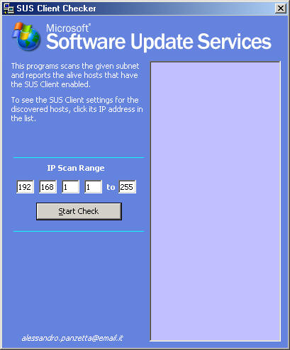



## SUS Client Subnet Checker

### Description

Microsoft Corporation has released the Software Update Services, a useful system to keep computers up to date for patches and hotfixes.

This program is intended to help Administrators to manage the SUS Client settings in a network.
 
### More Info
 
IP subnet to check for.

Given an IP address range, the program scans the network and checks if the connected hosts have the SUS Client enabled; if they have it, the program writes the discovered hosts in a list.

To see the client settings of a given host, simply clicking it on the list, the program opens a window containing the SUS Client settings and gives the opportunity to change the SUS Client settings

List of discovered hosts with SUS Client enabled

Use it with Domain Admin privileges

             |
---                |---
**Submitted On**   |2004-08-07 19:49:44
**By**             |[Alessandro Panzetta](https://github.com/Planet-Source-Code/PSCIndex/blob/master/ByAuthor/alessandro-panzetta.md)
**Level**          |Intermediate
**User Rating**    |5.0 (10 globes from 2 users)
**Compatibility**  |VB 6\.0
**Category**       |[Complete Applications](https://github.com/Planet-Source-Code/PSCIndex/blob/master/ByCategory/complete-applications__1-27.md)
**World**          |[Visual Basic](https://github.com/Planet-Source-Code/PSCIndex/blob/master/ByWorld/visual-basic.md)
**Archive File**   |[SUS\_Client177947882004\.zip](https://github.com/Planet-Source-Code/alessandro-panzetta-sus-client-subnet-checker__1-55435/archive/master.zip)

